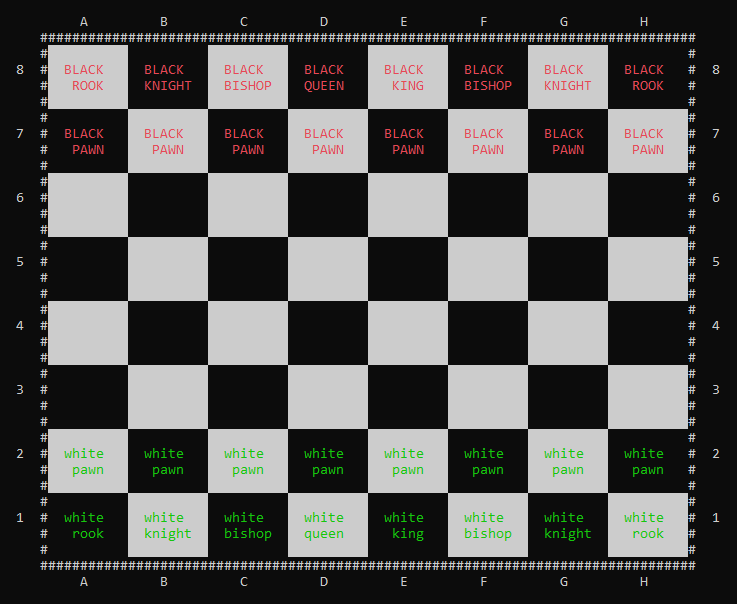
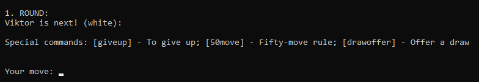
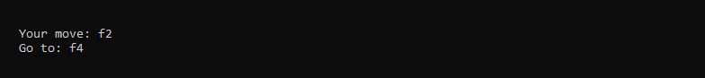
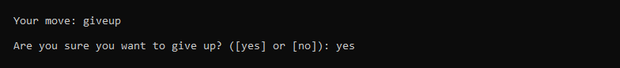

<h1 style="text-align: center; font-size:40px;">
CLI pyChess
</h1>

<p style="text-align: center;">
A simple command line utility for playing chess. This is not ment to be a professional version of the game, just a little trial for myself.
</p>



# Installation

In order to use the program you have to have python3 installed on your machine and you also need to run the following command in your terminal:

```
pip3 install colorama

or 

pip install colorama
```

# How to use it
<p>
Then to run the program just simply execute the chess.py file in the cli_pychess folder. I also recommend to change your location to that directory before execution.
</p>

```
python chess.py
```

# How to play

The game is very easy to play. In each round you will get the message below, which is used to tell you some crucial information. The first two lines shows the round count and which player is next (you can also see the color of the player). The third row contains the special commands and their brief description, more about that later. Finally there is the row where you can type your movement.



### __I: For normal moves:__

If you want to make a normal move you can do so. First type in the position where would you like to move from. The hit enter and tell the next position where would you like to move to. The picture below shows you how would it look like. If the move is legal than the table would get updated. If it's not then an error message occurs and you have to do something else.



### __II: For special commands:__

<p>
The special command are listed in brackets '[...]'. The functionality of these are listed below. If you want to make use one of them you can simply type it in as shows on the picture.
</p>

 * __giveup__ - This one is used for giving up a game. After you typed this in, you will get the option to take back the action. Else you will lose the game.
 * __50move__ - This one is used for performing a Fifty move role againts the opponent. This will cause a draw if the call is right.
 * __drawoffer__ - This one is used to offer a draw to the opponent. If you play this command then the opponent will have the option to accept or resufe your offer. If it gets accepted then the game will end in a draw.



# Work left

 * At this point the game could not detect a draw sitation, either the players have to agree manually to the draw by the 'drawoffer' command or you have to break the program by a Ctrl^C cut.
 * The checkForCheckmate() method is not completely correct. I mean it only thinks that only one player at a time could check the king.
 * Also there is no AI in the game, so you have to play with someone .


# Credit

The ASCII subtitles are from here: [patorjk.com](http://patorjk.com/software/taag/)